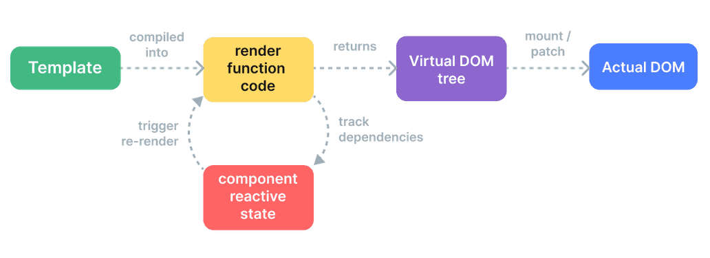

# 组件渲染流程

大致流程：
编译 `<template></template>`模板，生成`render`函数，执行 render 函数（响应式数据会将其作为依赖收集）生成 vnode，通过 patch 过程（diff）得到要渲染到视图中的 vnode，通过 vnode 创建真实 dom 并挂载到节点中。

当组件响应式数据更新时，render 函数由于之前被作为响应式数据副作用函数收集，所以会重新执行

## 渲染管线

1. 编译：Vue 模板被编译为渲染函数：即用来返回虚拟 DOM 树的函数。这一步骤可以通过构建步骤提前完成，也可以通过使用运行时编译器即时完成。
2. 挂载：运行时渲染器调用渲染函数，遍历返回的虚拟 DOM 树，并基于它创建实际的 DOM 节点。这一步会作为响应式副作用执行，因此它会追踪其中所用到的所有响应式依赖。
3. 更新：当一个依赖发生变化后，副作用会重新运行，这时候会创建一个更新后的虚拟 DOM 树。运行时渲染器遍历这棵新树，将它与旧树进行比较，然后将必要的更新应用到真实 DOM 上去。

[官方文档](https://cn.vuejs.org/guide/extras/rendering-mechanism.html#render-pipeline)

## 挂载与更新（patch）

/packages/runtime-core/src/renderer/patch:367

## vnode 的优势（pg36）

- 抽象，渲染过程抽象化，组件抽象能力得到提升
- 跨平台，对于 patch vnode 过程各平台可以有自己的实现
